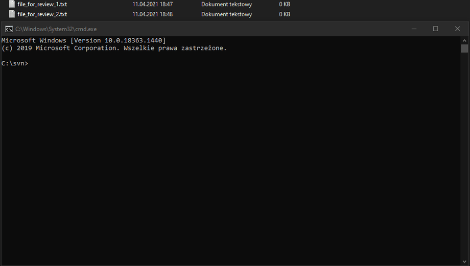
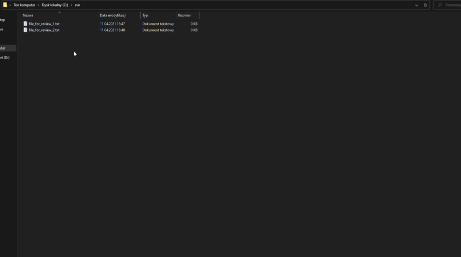

# RBTools GUI

RBTools GUI is a application built on top of [RBTools](https://github.com/reviewboard/rbtools), a set of command line tools for use with [Review Board](https://github.com/reviewboard/reviewboard). It is designed to give you flexibility known from [`rbt`](https://www.reviewboard.org/docs/rbtools/2.0/#rbt-command) command, at the same time taking away the pain of CLI interaction.

## Workflow

RBTools is powerful tool, but it is hard to use on day-to-day basis, especially for people that don't like to work with command line applications. 

### Features 
Using RBTools GUI you can forget about:
- [x] repeating the same commands over and over - focus only on what's truly important in your review: **its content**
- [x] remembering multiple application arguments and knowing when to use which - they will be issued automatically for you
- [x] knowing every nick of people you work with - you can just select them straight from the user interface
- [x] typing all of paths that should be included in the review - paths are assigned based on files you select for the review
- [x] having to escape CLI-illegal characters - this will be done behind the scenes for your convenience

### :x: Resign from rigid command line interface



### :heavy_check_mark: Boost your productivity using GUI-driven approach




## Getting Started

These instructions will get you a copy of the project up and running on your local machine for development purposes. See [deployment](#Deployment) for notes on how to deploy the project on a live system.

### Prerequisites

* [git](https://git-scm.com/) for cloning the repository
* IDE that can handle .NET/C# development

### Installing

1. Clone the repository
```sh
git clone https://github.com/abaniuszewicz/rbtools-gui.git
```
2. Set `RBTools.UI.Wpf` as startup project
3. Run solution

## Deployment

To deploy and make use of RBTools GUI on a live system, you're gonna need:
* Access to Review Board server (see [Review Board Administration Guide](https://www.reviewboard.org/docs/manual/dev/admin/))
* RBTools [downloaded](https://www.reviewboard.org/downloads/rbtools/), installed & added to the PATH

Having this set up all you have to do is to install this application itself. You should ensure that shortcut is located at `%appdata%\Roaming\Microsoft\Windows\SendTo\` as this is required for proper [workflow](#Workflow).

On the first launch you might want to create/import settings that define repository configuration as well as default selections of available options. This has to be done just once.

## Contributing

* [Report bug](https://github.com/abaniuszewicz/rbtools-gui/issues) or [request new feature](https://github.com/abaniuszewicz/rbtools-gui/issues) and help verify ones checked in
* Review [source code changes](https://github.com/abaniuszewicz/rbtools-gui/pulls)
* Submit [pull request](https://github.com/abaniuszewicz/rbtools-gui/pulls)

## License

This project is licensed under the MIT License - see the [LICENSE](LICENSE) file for details.

## Acknowledgments

* [Review Board](https://github.com/reviewboard/reviewboard) - open source review tool
* [RBTools](https://github.com/reviewboard/rbtools) - set of command line tools for use with Review Board
* [ModernWPF UI Library](https://github.com/Kinnara/ModernWpf) - modern style and controls for WPF applications
